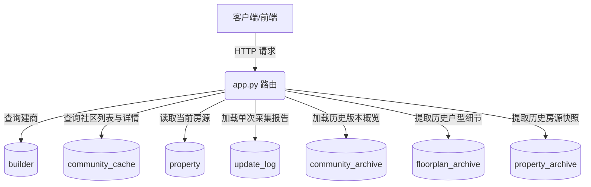

# 全美新房数据采集与智能监控平台项目分析报告

本报告对“全美新房建商（Home Builders）房源数据采集与智能监控平台”的项目功能、技术架构及底层数据库存储机制进行了深度剖析，旨在为后续系统优化与业务开发提供详实的技术文档支持。

---

## 一、 项目核心功能分析

本系统是一个高度解耦、前后端协同运作的新房数据挖掘与智能分析监控平台。它集成了网络爬虫状态管理、社区多版本归档、房源变动轨迹追踪以及基于数据挖掘的性价比洞察。

### 1. 爬虫代理与批量采集控制台
* **爬虫状态监控**：通过分布式接口（`api_url/api/status`）实时获取每个独立建商爬虫的运行状况（如 `idle`、`running`、`completed`、`error`）。
* **非阻塞批量采集**：支持一键触发/终止所有建商的批量采集流程。在后台开启独立守护线程，按照数据库中的 `sort` 字段权重依次调度各个爬虫 API，降低并发冲突。
* **中断自动恢复**：系统在初始化启动时，会自动扫描数据库中正在运行的任务并尝试重新连接，防止因网络闪断、服务器重启导致大批量任务数据丢失。

### 2. 社区维度数据检索与分页
* **多表关联过滤**：支持建商名称、采集更新状态（“无更新”/“有更新”）及关键字（社区名称/地址）进行多条件复合查询。
* **高响应式数据网格**：前台提供流畅的分页加载与响应式列表渲染，便于快速检索特定的目标社区。

### 3. 房源详情与多版本历史归档
* **更新日志宏观看板**：记录并展现每次数据抓取时的存量/增量变化指标（户型数量、房源数量、在售、售罄及状态分布变动）。
* **房源全生命周期监测**：记录房源挂牌以来的当前售价、历史最低价（及时间）、历史最高价（及时间），精准监控降价或涨价行为。
* **价格与状态波动排行**：运用统计算法分析特定社区下所有房源的“变价次数”与“状态切换频率”，生成综合评分并输出 Top 20 波动最大房源。

### 4. 房源价格/状态单兵走势分析
* **时间轴走势绘制**：以前端图表（ECharts/Chart.js 兼容结构）为载体，按采集期数（`archive_no`）及对应的时间戳，动态绘制单套房源在历史多轮采集中的价格阶梯图与状态变迁轨迹。

### 5. 数据智能洞察仪表盘 (Data Intelligence Insights)
* **降价幅度排行榜**：在非已售（`Sold`）房源中，按“最高价 - 当前价”的降价绝对金额与百分比进行倒序排列，输出 Top 10 性价比暴增房源。
* **高性价比活跃房源推荐**：结合房源在历史归档中的活跃度得分（变价频次、状态改动频次权重）与当前每平方英尺价格（`price / size`）的低洼度，智能化挑选最值得关注的优质房源。
* **滞销房源预警看板**：计算房源自录入以来的市场停留天数（`DATEDIFF(NOW(), created_time)`），倒序输出在售时间最久的 Top 10 滞销预警房源，自动过滤无效或空 Title 条目。

---

## 二、 数据源归属（服务器与数据库配置）

系统的数据存储与通信全部依靠以下 MySQL 数据库服务：

| 属性 | 配置值 | 备注 |
| :--- | :--- | :--- |
| **服务器 IP (DB_HOST)** | `107.174.240.114` | 远程数据库服务器主机 |
| **数据库名 (DB_NAME)** | `topskyhome_gather_log` | 采集系统专用数据库 |
| **数据库用户 (DB_USER)** | `allon` | 数据库访问账号 |
| **持久层驱动 (Driver)** | `pymysql` | 搭配 `DBUtils` 数据库连接池提高并发效能 |

---

## 三、 API 接口与数据表映射参考指南

后端路由接口均定义于主应用 `app.py` 中，其与数据库底层表的增删改查（CRUD）交互关系整理如下：

### 1. 核心数据表结构与功能定义

| 表名 | 功能描述 | 核心字段示例 |
| :--- | :--- | :--- |
| **`builder`** | 建商（爬虫代理）配置表 | `builder_id`, `builder_name`, `api_url`, `sort`, `update_time` |
| **`community_cache`** | 社区当前最新状态表 | `id`, `builder`, `name`, `address`, `url`, `uuid`, `archive_no`, `update_time` |
| **`property`** | 房源当前最新状态表 | `id`, `property_uuid`, `community_id`, `title`, `price`, `lowest_price`, `highest_price`, `status` |
| **`update_log`** | 单次采集宏观指标日志表 | `id`, `community_id`, `floorplan_count`, `property_count`, `property_sale`, `note`, `created_time` |
| **`community_archive`** | 社区历史采集时间与区间归档 | `id`, `uuid`, `archive_no`, `price`, `price_max`, `size_min`, `archive_time` |
| **`floorplan_archive`** | 各采集期数下的户型历史归档 | `id`, `community_uuid`, `archive_no`, `name`, `bedroom_num`, `price`, `stories` |
| **`property_archive`** | 各采集期数下的房源历史归档 | `id`, `community_uuid`, `archive_no`, `uuid`, `title`, `listing_price`, `status`, `address` |

### 2. 底层路由接口与数据表级交互详情

#### 📌 建商管理及基础列表
* **`GET /` & `GET /collection`**
  * **功能**：获取建商控制台基本列表。
  * **涉及表**：`builder`
  * **SQL逻辑**：`SELECT * FROM builder ORDER BY sort ASC, builder_name ASC`
* **`GET /api/communities` & `GET /api/stats/communities`**
  * **功能**：带条件过滤与分页检索的社区列表。
  * **涉及表**：`community_cache` (cc), `builder` (b) (LEFT JOIN)
  * **SQL逻辑**：结合 `cc.builder = b.builder_id`，利用关键字进行 `LIKE` 模糊匹配，按更新时间降序并做分页限流。

#### 📌 详情展示与日志分析
* **`GET /detail/<int:community_id>`**
  * **功能**：获取某个特定社区的信息及其采集更新统计历史。
  * **涉及表**：`community_cache` (单条查询), `update_log` (按时间降序的多条记录)
* **`GET /api/properties/<int:community_id>`**
  * **功能**：获取社区当前的全部真实在售房源。
  * **涉及表**：`property`
  * **特色逻辑**：由于某些旧字段存储格式问题，SQL中使用 `CAST(title AS CHAR)` 处理二进制编码，并进行字段反序列化验证。
* **`GET /api/archive-detail/<uuid>/<int:archive_no>`**
  * **功能**：查询某次特定采集期数中的户型与房源完整备份。
  * **涉及表**：`floorplan_archive`, `property_archive`
  * **匹配策略**：利用 `community_uuid` 与 `archive_no` 组装复合索引查询。

#### 📌 趋势演变与走势统计
* **`GET /history/<uuid>`**
  * **功能**：加载社区的宏观发展历史曲线。
  * **涉及表**：`community_archive`
  * **特色逻辑**：采用 `COALESCE(archive_no, id) DESC` 排序策略，确保在 `archive_no` 部分缺失时时间轴依然平滑。
* **`GET /api/property-history/<int:community_id>/<property_uuid>`**
  * **功能**：绘制单套房源变价/变状态走势。
  * **涉及表**：`property_archive` (pa), `community_archive` (ca) (LEFT JOIN)
  * **SQL逻辑**：`pa.community_uuid = ca.uuid AND pa.archive_no = ca.archive_no`，用于补充每一次房源变动时的绝对自然时间戳。
* **`GET /api/property-changes/<int:community_id>`**
  * **功能**：分析社区中近期变动剧烈的房源排行 Top 20。
  * **涉及表**：`property`, `property_archive`
  * **核心算法**：
    1. 读出当前全量房源，并取出对应 UUID 社区的所有历史归档。
    2. 按 Title 分组归纳，遍历历史版本，对前后两次相邻轮次进行对比。
    3. 发生状态切换记 `2` 分，价格变更记 `1` 分，加入最高/最低价的绝对差价百分比偏置。
    4. 计算出 `change_score` 降序排列。

#### 📌 可视化图表数据统计
* **`GET /api/stats/archive/<uuid>`**
  * **功能**：生成户型和房源采集轮次数量对比柱状/折线图。
  * **涉及表**：`floorplan_archive`, `property_archive`, `community_archive`
  * **SQL逻辑**：按 `archive_no` 分组，使用 `COUNT(*)` 聚合，然后由后端内存结构映射进行三表时间轴合并。
* **`GET /api/stats/price-trend/<uuid>`**
  * **功能**：生成社区价格均线、区间走势及房源售卖状态分布图。
  * **涉及表**：`property_archive`, `community_archive`
  * **核心指标**：`MIN(listing_price)`、`MAX(listing_price)`、`AVG(listing_price)`，以及通过 `SUM(CASE WHEN status = ...)` 聚合出的状态区间。

#### 📌 智能算法挖掘洞察
* **`GET /api/insights/price-drops`**
  * **功能**：近期大幅度变相降价促销房源。
  * **涉及表**：`property` (p), `community_cache` (cc), `builder` (b)
  * **SQL逻辑**：筛选 `p.status != 'Sold' AND p.price > 0 AND p.highest_price > p.price`，计算 `drop_amount` (降幅金额) 和 `drop_pct` (降幅占比)，降幅绝对值大者优先。
* **`GET /api/insights/active-value`**
  * **功能**：最受市场欢迎高性价比精选房源。
  * **涉及表**：`property`, `property_archive`, `community_cache`, `builder`
  * **核心算法**：抓取每平方英尺单价最低的 active 房源，交叉比对归档中的调价变动频次，加权评分推荐。
* **`GET /api/insights/stagnant`**
  * **功能**：挂牌时长爆表房源预警（过滤空/无效条目）。
  * **涉及表**：`property` (p), `community_cache` (cc), `builder` (b)
  * **SQL逻辑**：`WHERE p.status != 'Sold' AND p.price > 0 AND p.title IS NOT NULL AND p.title != ''`，按 `p.created_time ASC` 绝对升序拉取。

---

## 四、 总结与维护建议

1. **索引优化建议**：
   * 针对大量的多表 JOIN 和归档检索，建议在 `property_archive` 的 `(community_uuid, archive_no)` 及 `(community_uuid, uuid)` 字段上建立复合索引，这能大幅度降低 `/api/property-history` 和 `/api/property-changes` 接口在海量归档数据下的查询开销。
2. **字符编码兼容性**：
   * 数据库中 `property.title` 或 `property_archive.title` 字段可能包含特定表情或特殊二进制编码，因此在所有涉及 title 的底层 SQL 查询中都加上了 `CAST(title AS CHAR)`，在编写新接口时需严格遵守该规范。
3. **连接数释放**：
   * 当前系统在各路由上下文中执行完查询后，都会在 `finally` 块中显式执行 `cursor.close()` 和 `conn.close()`。在后续二次开发扩展路由时，必须保持此良好实践，防止高并发访问导致 MySQL 连接池溢出崩溃。

---
*本报告由 Antigravity 智能分析系统自动生成，并已就地保存至工作区中。*
